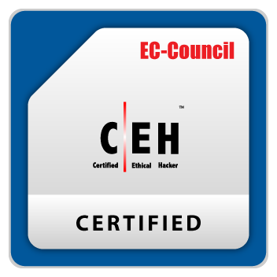

# Rudra Sharma

  

**Cybersecurity | Malware Analysis | Digital Forensics | Python**

Cybersecurity practitioner focused on building practical security tools and gaining hands-on experience in malware analysis, vulnerability research, and defensive security.

---

## About

I enjoy understanding how systems fail, how attackers exploit them and how defenders detect and respond to security threats. My work focuses on building practical tools that solve real security problems while strengthening my skills in malware analysis, digital forensics, and defensive security.

### Areas of Interest

- Malware Analysis
- Digital Forensics
- Vulnerability Research
- Web Application Security
- Detection Engineering
- Linux

---

## Featured Projects

### [Malware-Lab](https://github.com/roodra-afk/Malware-Lab)

Hands-on malware analysis laboratory for performing static and dynamic malware analysis in an isolated environment.

### [VulnSight](https://github.com/roodra-afk/vulnsight)

Python-based web vulnerability scanner featuring recursive crawling, SQL injection testing, reflected XSS detection, form analysis, attack-surface deduplication, and structured vulnerability reporting.

### [StegX](https://github.com/roodra-afk/stegx)

Steganography toolkit utilizing AES-GCM encryption for securely embedding and extracting hidden information from image files.

---

## Certifications

- Certified Ethical Hacker (CEH)
- TryHackMe — Top 1%

---

## Activity

---

## Connect

